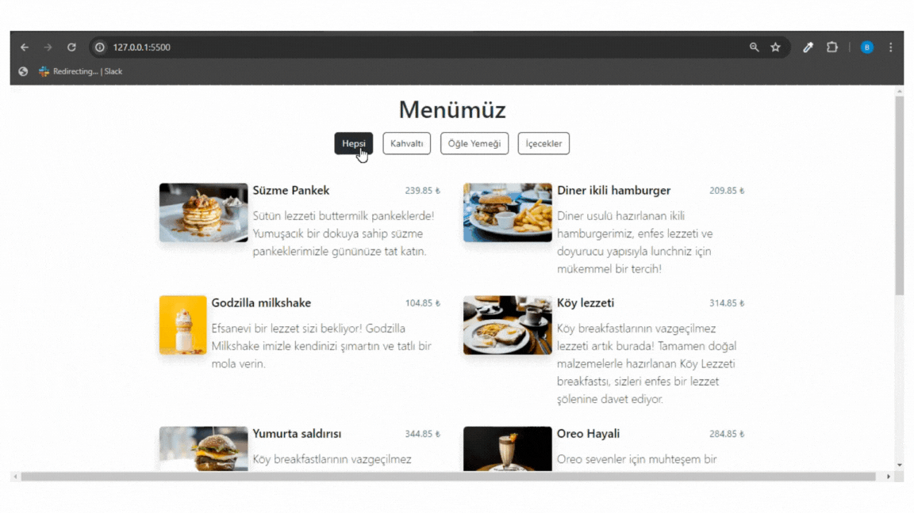

## QR-Menu

- Bu proje, HTML, CSS, JavaScript ve Bootstrap kullanılarak oluşturulmuş, duyarlı bir menü uygulamasıdır.

- Proje, çeşitli cihazlarda ve ekran boyutlarında uyumlu çalışacak şekilde tasarlanmıştır (Responsive Tasarım)

### Kullanılan Teknolojiler 

- HTML 

- CSS

- JavaScript

- Bootstrap 

### Screen 

